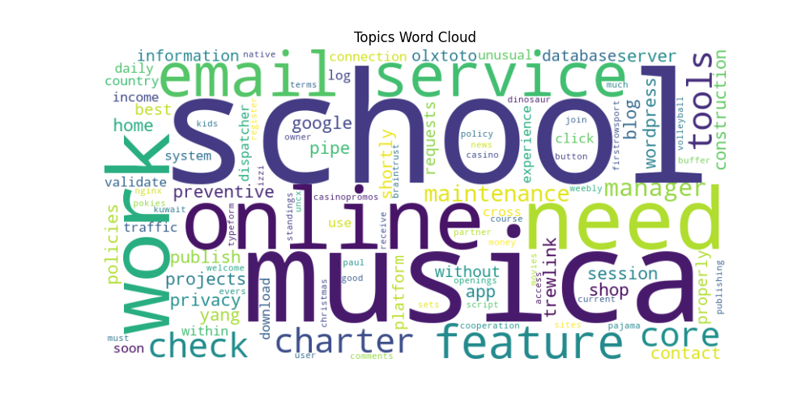

# CrawlData_Unsupervised_Learning

This is a Python project I made that is using the dataset downloaded from the Common Crawl web archive since it is open source and free.

It processes the text data and conducts unsuperviised topic modeling using Latent Dirichlet Allocation (LDA). 

My goal is to process and return meaningful topics within the large corpus of a web-crawled data, that is mostly random data from webpages around the world, and visualize them using word clouds to see which topics are being talked about aorund the World wide web.

##Example Word Cloud Output

## Project Overview

1. It downloads latest WARC (Web ARChive) file from Common Crawl. In this case it is using the WET file which is mostly text content.
2. Automatically decompress and read in the WET file. Filter for it to be English content with regular expression and `langdetect` lib.
3. Preprocessing the text through tokenizing and stop words. Generated bigrams and trigrams. 
4. Built a dictionary and corpus for LDA unsupervised learning.
5. Applying LDA to get topics from the corpus.
6. Post-processed the topics to get nouns and remove abbreviations.
7. Finally visualized the topics with word clouds.

## Dependencies
- Python 
- warcio
- langdetect
- gensim
- nltk
- matplotlib
- wordcloud

You can also choose your own WRC/WET dataset to use from https://commoncrawl.org instead of using the one I tested with. 

## Installation

1. Clone the repository:

git clone https://github.com/heming277/CrawlData_Unsupervised_Learning.git

2. cd CrawlData_Unsupervised_Learning

3. pip install -r requirements.txt

## Usage

python LDA_Learning.py
